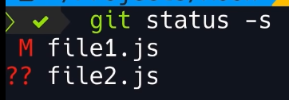

## Git Overview
- Git is the most popular open source version control system.
    - This will track/manage all changes made to files over time in a special database called a *repository*.
    - If you mess up something in your project, you can easily revert back to a previous state.
    - Use Git BASH for Windows
    - Git stores a complete snapshot of each commit and stores it in a compressed state.
---
<br>

## Version Control System
- There are 2 types:
    - <u>Centralized:</u> all members connect to a central server to get the latest copy of code.
        - Subversion and Microsoft Team Foundation Server are examples
        - This has a single point of failure due to the single server.

    - <u>Distributed:</u> every member has a copy of the project with its history on their own machine.
        - Git and Mercurial are examples
        - No single point of failure.
---
<br>

## GUI Tools
- GitKraken and Sourcetree
- GUI tools have limitations and will need to be supplemented with Git CLI
- GUI tools are not always available
---
<br>

## Git Settings
- 3 types of settings:
    - **System:** settings for all users
    - **Global:** settings for all repositories for the current user
    - **Local:**  settings for the current repository
    - Use **git config** command; see below.

- An important setting is the carriage return and line feed.
    - carriage return is \r
    - line feed is \n
    - Windows systems use \r\n at the end of a line
    - Mac systems use \n only at the end of a line
    - setting to configure is *core.autocrlf*
        - if using Windows this setting should be set to **True**
            - this will remove the \r at EOLs when updating the repository
            - This will add \r back in when downloading the repository on a Windows machine.
        - if you are on a Mac, the setting should be **input**

- Each repository has a hidden folder called **.git**
    - this stores all changes you make to the repository and its settings

- You can install **posh-git** on Windows to have a terminal that's a little easier to read (optional).
---
<br>

## .gitignore File
- This file tells git to ignore certain directories and files that should not be in the repository.
- You can create this file and add in a directory:
- ```bash
    echo logs/ > .gitignore
    git add .gitignore
    git commit -m "Add gitignore"
    ```
- Make sure the file or directory you are adding is not in the Staging Area or Git will keep tracking it.
- Use **`git rm --cached -r directory/`**
- Use gitignore templates for different programming languages or for certain file types. [Click here](https://github.com/github/gitignore)
---
<br>

## Git commands:
- ### **`git config --global user.name "Aldo Oliveri"`**
    - sets the author name
    - **`user.email "email@example.com"`** sets author's email
    - **`core.editor "code --wait`"**
        - set default editor
        - 'code' is for VSCode;
        - Default editor for Git is vim
        - **`--wait`** tells the terminal to wait for VScode to exit
    - **`--global -e`**
        - To edit all global settings
        - This file is called *.gitconfig*
    - **`--global core.autocrlf true or input`**
        - To set the crlf option
        - true if using Windows
        - input for MacOS
    - **`--global diff.tool vscode`**
        - To set the default diff tool
    - **`--global difftool.vscode.cmd "code --wait --diff $LOCAL $REMOTE"`**
        - Tells how to launch the diff tool
        - `--diff` tells Git to use VSCode for diffing or comparing files
        - `$LOCAL, $REMOTE` are place holders for the old and new copies of the files
        - Check the *.gitconfig* file if the changes are there (might have to add placeholders in).
        - Once this is set use `git difftool` instead of `git diff`.
---

- ### **`git config --help`**
    - options help
    - can also get this online
    - use `-h` for quick help
---

- ### **`git init`**
    - use to initialize a new repository
    - create a new folder
    - in your terminal cd to the new folder
    - then use this command
    - this will create a hidden subdirectory called **.git**
        - this is your new repository
---

- ### **`git add [filename or . ]`**
    - adds files that Git is not tracking to the staging area
    - Git starts tracking changes in files once added
    - Can add by `filename`, by pattern (`*.txt`), or by '`.`' which adds all files in the directory recursively that are untracked.
    - adds files and changes made in your Working Directory to the Index or Staging Area
    - use **`git status`** to view untracked files.
---

- ### **`git status`**
    - shows all files added, modified, or deleted
    - used with flag `-s` for a summary form
        - 
        - The left column is the Staging Area
        - The right is the Working Directory
---

- ### **`git diff [branch_name]`**
    - this will compare all changes between the specified branch name and the master branch.
    - `--staged` use this to compare files in the Staging Area
        - the + sign indicates changes made
    - running `git diff` without arguements will compare changes in the working directory with the staged area.
    - Diff tools to compare files:
        - KDiff3, P4Merge, WinMerge, VSCode
---

- ### **`git difftool [arguments or none]`**
    - this command will use the default diff tool you set up to compare files.
    - this tool makes it easy to compare changes
---

- ### **`git commit [filename] -m ["message"]`**
    - If you don't use a file name, this will commit all files in the staging area
    - the **`-m`** flag is a descriptive message title < 80 char.
    - you can add another `-m` to add a long description
    - If you don't use the `-m` it will open the editor and you can type a short message on the 1st line; 
        - then add a line break; 
        - on the 3rd line a long message
    - This will commit or update the git repository **.git** file.
    - You can also use the **`-a`** flag to skip the Staging Area and commit.
    - Each commit contains a Unique ID, message, date/time, author (view in log)
---

- ### **`git ls-files`**
    - to view files in the Staging Area.
---

- ### **`git rm file1`**
    - this will remove files in your Working Directory and the Staging area
---

- ### **`git rm --cached -r directory/`**
    - this will remove directories recursively from the Index or staging area
    - Use also with just a filename.
---

- ### **`git mv file1 newfile`**
    - this will rename a file in both your Working Directory and the Staging Area.
---

- ### **`git log [optional arguments]`**
    - shows a history of all the commits created sorted from the latest to the earliest.
    - The log will show a unique identifier:
        - a 40 character hexadecimal string
    - Author's name, email, date/time, message
    - **HEAD -> master**, HEAD indicates what branch we are currently working on.
    - `--oneline` shows each commit entry one one line
    - `--reverse` adding this argument will reverse the sort order
---

- ### **`git show [options]`**
    - This command is used to show what was changed in a given commit.
    - For options, you can use the 7 digit unique identifier after using the `git log --oneline` command.
    - Another option is using `HEAD` for the latest commit
    - `HEAD~1` to show the previous commit from HEAD
        - use whatever number needed
    - `HEAD~1:path/file` to show the final copy of the file committed.
---

- ### **`git ls-tree [id or HEAD~]`**
    - To show all the files and directories in a commit
    - blobs are files
    - trees are directories
    - this will show commits and tags as well
---

- ### **`git restore --staged [files]`**
    - Use this to remove files from the staging area and bring back to its previous state in the Working Directory.
        - If there is no previous state the file will be removed from the staging area indicated by ??
    - this command is better to use than `git reset`
    - `git restore file` this will take the file from the staging area and copy it into the working directory.
    - `git restore --source=HEAD~1 filename` this option can be used to restore a file that you accidently deleted from a commit.
---

- ### **`git clean -fd`**
    - use this to remove untracked files from the staging area.
    - `-fd` stands for force removal and directories
---

- ### **`git push origin master`**
    - use to upload the changes you committed to Github
    - use `-u origin master` to set an upstream default
        - this means you don't have to type out 'origin master' everytime and is the default location push will use.
---

- ### **`git remote add origin [repository_link]`**
    - If you cannot push a new repository folder to Github, you need to:
        - First create the empty repository on Github
        - Copy the link to the repository
        - use the above command in the terminal to connect the remote repository to your folder in VScode.
    - Check with `git remote -v`
---

- ### **`git branch`**
    - shows the branches you created.
    - an * next to a branch is the current branch you are in.
    - use with `-d [branch_name]` to delete a branch that you are finished with.  Use this after merging branches.
---

- ### **`git checkout [branch_name]`**
    - use to switch between branches
    - use with `-b [new_branch]` to create a new branch
---

- ### **`git pull origin master`**
    - if `-u` (set upstream) flag is set, just use `git pull`
    - use this to update the master branch respository on your hard drive from Github
    - this is used after merging branches on Github
---

- ### **`git reset [file]`**
    - use to unstage a file.
    - instead of filename you can use HEAD~1 to unstage the previous commit.
    - can also use unique hash identifier of the commit instead of filename to unstage a file. (see git log)
    - use `--hard [hash]` to unstage and undo changes in a file.
    - use `git restore` instead
---

- ### **`git clone [repository_link]`**
    - save the repository folder to your hard drive.
   --- 
 <br>

- ## Git Branching
    - Creating a separate branch from the master branch allows one to work on a project without disrupting the files in the master branch.
        - An example would be updating software in a separate branch and making sure it works properly before merging it with the master branch.
---
<br>

- ## Git Forking
    - In Github page, use this feature to copy an entire repository including the branches of someone elses files that you do not have permission to modify.
    - This will create an exact copy in your account that you will have permission to do whatever you need to.